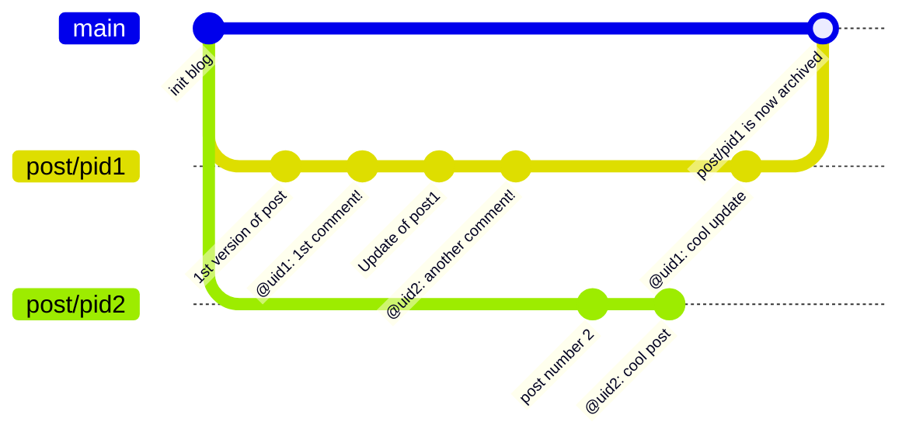
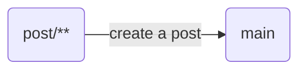
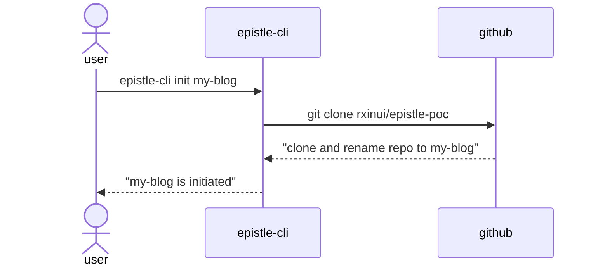
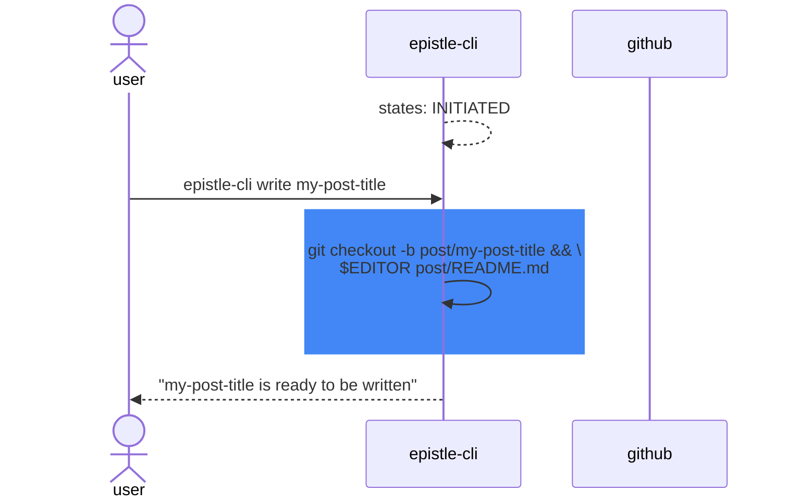
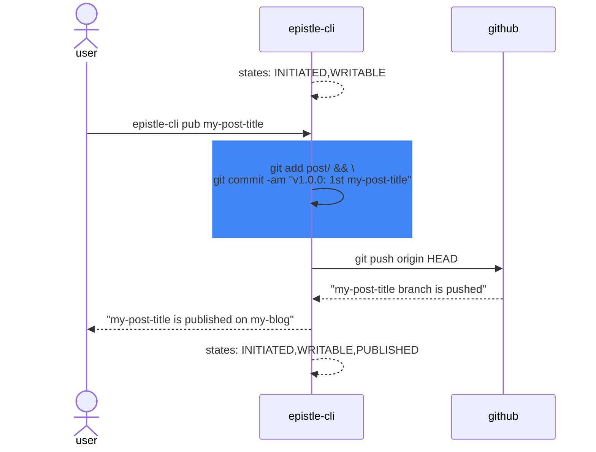

# Epistle PoC

*Your blog on your favourite terminal using git.*

**Epistle** leverages `git` to create a blog and `VCS git server` to host it making it available publicly and readable right from your terminal.

## Feature of `epistle-cli`

### For bloggers

#### Primary commands
- `login` - signs in to a VCS git server with required permissions
- `init` - initialises a repo as a blog fully managed by epistle on top of **git**
- `pub` - publishes a post to an epistle blog making it publicly available

#### Secondary commands
- `archive` - archives a post on epistle (by merging its coresponding branch to `main`)
- `lock` - locks a post to read-only
- `unlock` - unlocks a post form read-only

### For readers

#### Primary commands
- `sub` - subscribes to a public epistle blog (git repository hosted on VCS git server)
- `unsub` - unsubscribes to a public epistle blog (git repository hosted on VCS git server)
- `read` - reads a post from a public epistle blog (git repository hosted on VCS git server)
- `list` - lists out epistles subscribed

#### Secondary commands
- `feed` - displays the latest activities (comments + posts) on subscribed epistle blogs
- `peek` - peeks on a VCS repository link to get quick information about blog
- `discover` - watches the latest public blog instantiated every specific interval of time (ie. 2s)
- `comment` - comments on a post 

## Structure of a Blog

A **blog** is built using a collection of pre-structured files and git objects.

### File objects

The following files are instantiated and managed by `epistle-cli`. It stores the content of blog's posts.

- `history.lock` list all interactions made to the blog by the author and its subscribers. Format is currently CSV.
- `post/README.md` stores the content of a post written using Markdown syntax. It can include images (or other markdown resources supported such as snippet) included within `post/rsc/**`.
- `archives/` list all archived posts with their content. Their respectives branches will be merged to `main` branch and disappear from the CLI feeds. However, archived posts will remain accessible through VCS server by navigating through UI.

### Git objects

Usage of **git branches** following the [Trunk Based Development model](https://trunkbaseddevelopment.com/) enable the creation of posts and the ability to comment them by anyone.

- `main` serves as the trunk (default branch) which keeps track of all posts, subscribers, archives and any metadata.
- `post/**` indicates a new post of the blog. Acts mainly on the `post/` directory.

The relation of the git objects is represented as follow:

## Workflows

### Initiate an epistle blog

OUTPUT STATES: `INITIATED`

### Starts the writting of an epistle post

**Requirement**: `INITIATED`

OUTPUT STATES: `WRITABLE`

### Publish an epistle post

**Requirement**: `INITIATED`, `WRITABLE`

OUTPUT STATES: `PUBLISHED`